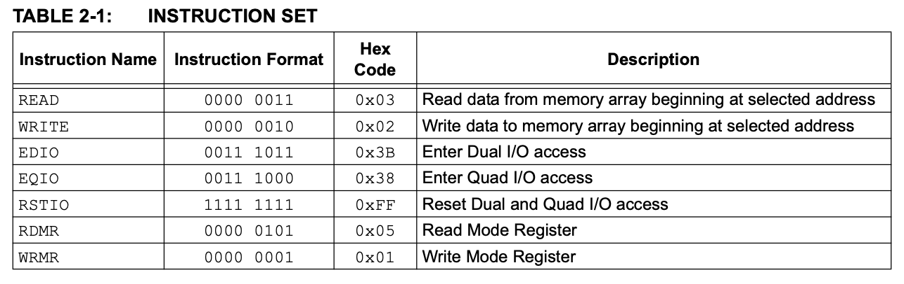
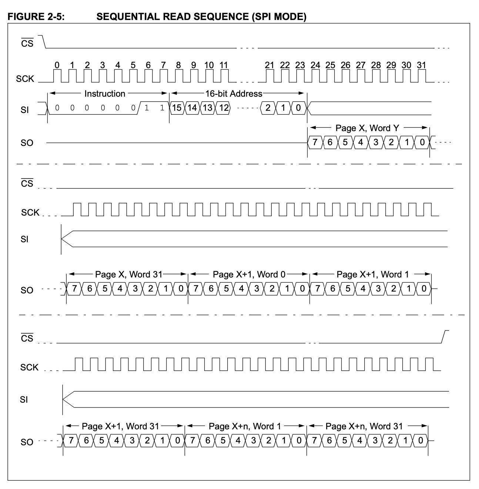

# SPI Memory Controller Specification

**Document Version:** 1.0  
**Date:** 29 April 2026  
**Project:** Tetra-SoC  
**Module:** `wb_spi_mem_ctrl`  
**Bus Interface:** Wishbone (B4)  

---

## 1. Overview

The SPI Memory Controller is a Wishbone-compliant IP core that implements sequential read operations from 23LC512-style SPI RAM devices. The module supports single-byte and block-mode sequential reads using SPI Mode 0 (CPOL=0, CPHA=0).

### 1.1 Key Features

- **SPI Mode 0** — CPOL=0, CPHA=0; sample MOSI on rising edge, change MISO on falling edge
- **Sequential Read Support** — continuous reads with automatic address increment
- **23LC512 Compatible** — implements read command (0x03) with 16-bit address
- **Wishbone Interface** — standard 8-bit data bus with address decoding
- **Interrupt Generation** — byte-done and block-done IRQ outputs with enable masking
- **Block Fetch Mode** — configurable byte-count limit with automatic completion signaling

---

## 2. Architecture

### 2.1 Module Hierarchy

```
wb_spi_mem_ctrl (top-level wrapper)
├── wb_spi_mem_ctrl_regs (register bank)
└── spi_mem_ctrl_core    (SPI state machine & I/O)
```

- **Top Wrapper** (`wb_spi_mem_ctrl`) — Wishbone interface, byte counting, and sequential logic
- **Register Bank** (`wb_spi_mem_ctrl_regs`) — auto-generated from YAML specification
- **SPI Core** (`spi_mem_ctrl_core`) — 24-bit command/address transmit, 8-bit data receive

### 2.2 Register Map

See [Register Map Documentation](./wb_spi_regs.md) for full details.

| Register | Address | Width | Access | Description |
|----------|---------|-------|--------|-------------|
| `SPI_CTRL` | 0x00 | 8 | RW | Control start pulse and fetch mode selection |
| `SPI_STATUS` | 0x04 | 8 | RO | SPI busy flag and error status |
| `MAX_FETCH_SIZE` | 0x08 | 8 | RW | Maximum byte count for sequential fetch |
| `BYTES_FETCHED` | 0x0C | 8 | RO | Current byte counter (increments per valid byte) |
| `IRQ_STATUS` | 0x10 | 8 | RW (rw1c) | Interrupt status flags (write-1-to-clear) |
| `IRQ_ENABLE` | 0x14 | 2 | RW | Interrupt enable masks for byte_done and block_done |

---

## 3. Clocking

### 3.1 Clock Requirements

**SYS-CLOCK-001:** The module shall operate on a single system clock (`clk`) driving both Wishbone interface and SPI transaction state machines.

**SYS-CLOCK-002:** The SPI clock (`sck`) output shall be derived from `clk` via Mode 0 bit-banging; one phase transition (SCK low↔high) shall occur per clock cycle.

**SYS-CLOCK-003:** The maximum `clk` frequency is not constrained by the design; achievable SPI clock rate depends on the synchronous output delay and receiver setup time.

**SYS-CLOCK-004:** SPI transfer duration shall be predictable; each SPI bit requires exactly 2 clock cycles (1 for SCK low, 1 for SCK high).

---

## 4. Reset and Initialization

### 4.1 Reset Behavior

**RESET-001:** The module shall provide a synchronous active-low reset signal (`rst_n`).

**RESET-002:** Upon assertion of `rst_n=0`, all state machines shall return to their idle states:
- SPI core state → `ST_IDLE`
- Byte counter → 0
- RAM address → 0x0000
- All Wishbone outputs → default (data=0, ack=0)

**RESET-003:** Reset shall be synchronous to `clk`; deassertion of `rst_n` shall be synchronized before use in the design to avoid metastability.

**RESET-004:** The SPI output signals (`cs_n`, `sck`, `mosi`) shall be driven to safe idle levels during reset:
- `cs_n` → 1 (inactive/high)
- `sck` → 0 (low)
- `mosi` → 0 (low)

### 4.2 Power-On Reset

**RESET-005:** Upon power-on, all internal registers shall initialize to their default/reset values as defined in the register map (see [Register Map](./wb_spi_regs.md)).

**RESET-006:** The SPI controller shall not initiate any transactions until software explicitly writes to the `SPI_CTRL.start` register or after reset is deasserted and the system clock is stable.

---

## 5. Clock Domain Crossing (CDC)

### 5.1 Synchronous Design

**CDC-001:** All design logic shall operate within a single synchronous clock domain (`clk`).

**CDC-002:** There shall be no asynchronous clock domain crossing internal to the module; external SPI signals (`miso`) shall be treated as synchronous inputs sampled on the clock edge.

**CDC-003:** If future designs require an external asynchronous SPI clock separate from the system clock, a synchronizer (e.g., 2-flip-flop chain) shall be inserted on the `miso` input to prevent metastability.

**CDC-004:** The `rst_n` signal may originate from an asynchronous reset source (e.g., power-on reset); the design shall assume that `rst_n` is properly synchronized before reaching the clock inputs of the module.

---

## 6. Functional Specification

### 6.1 Operating Modes



NOTE: currently: only read mode is supported (0x3)

#### 6.1.1 Single Byte Fetch (Non-Sequential Mode)

**MODE-SINGLE-001:** When `SPI_CTRL.fetch_mode` = 0 (Byte Fetch mode), each write to `SPI_CTRL.start` shall initiate a single 8-byte read transaction.


**MODE-SINGLE-002:** After each byte is received, the SPI core shall:
1. Assert `busy` ← 0
2. Assert `valid` (pulse) for one clock cycle
3. Latch the byte into `data_out`
4. Return to idle state and release `CS_N`

**MODE-SINGLE-003:** The byte counter (`BYTES_FETCHED`) shall increment only after the byte has been successfully received and `valid` is asserted.

#### 6.1.2 Sequential Block Fetch (Sequential Mode)

**MODE-SEQ-001:** When `SPI_CTRL.fetch_mode` = 1 (Block Fetch mode), a write to `SPI_CTRL.start` shall initiate a multi-byte sequential read.

**MODE-SEQ-002:** The SPI core shall maintain `CS_N` low and continuously clock data into `shift_in` after each byte is received, without releasing chip select.

**MODE-SEQ-003:** After each byte is received in sequential mode:
1. Assert `valid` (pulse) for one clock cycle to signal a valid byte
2. Automatically load the next byte from RAM (address auto-increments)
3. Remain in ST_RECV state unless `last` is asserted

**MODE-SEQ-004:** The transaction shall terminate when:
- The `last` signal is asserted by the wrapper (indicating `byte_count == max_byte_count - 1`), **OR**
- Software writes to any register (which triggers CS_N high via `start` pulse)

**MODE-SEQ-005:** Upon termination of a block transfer, the wrapper shall:
1. Assert `spi_block_fetch_done` signal
2. Increment the RAM address by `max_byte_count` for the next block
3. Reset the byte counter to 0

INFO: SPI Sequental read sequence:


### 6.2 Command and Address Transmission

**COMMAND-001:** All read transactions shall begin by transmitting the SPI read command byte `0x03` followed by a 16-bit address (MSB first).

**COMMAND-002:** The address shall be sourced from the internal register `ram_addr`, which is managed by the wrapper:
- Increments by 1 for each byte read in sequential mode
- Resets or updates per software control

**COMMAND-003:** The address transmitted shall be the **full 16-bit value**; the 23LC512 supports up to 64K address space via 16-bit addressing.

**COMMAND-004:** The command/address phase shall transmit bits MSB-first (big-endian) to match SPI convention.

### 6.3 Data Reception

**DATA-RECV-001:** Data shall be received MSB-first on the MISO line; each received bit shall be sampled on the rising edge of SCK.

**DATA-RECV-002:** An 8-bit data byte shall be shifted into `shift_in` over 8 clock cycles (16 transitions of SCK).

**DATA-RECV-003:** Upon completion of each byte reception, the value shall be latched into `data_out` and the `valid` signal shall pulse for one clock cycle.

**DATA-RECV-004:** In sequential mode, the next byte shall be pre-loaded from memory immediately after the previous byte is complete, allowing back-to-back reception without gaps.

### 6.4 Sequential Address Management

**ADDR-001:** The RAM address (`ram_addr`) shall be managed by the wrapper and shall be incremented by 1 for each byte successfully received in sequential mode.

**ADDR-002:** When a block fetch completes (`byte_count == max_byte_count`), the address shall be incremented by `max_byte_count` (block stride) to point to the next sequential block.

**ADDR-003:** The address shall wrap at the 23LC512 memory boundary (64K address space); address arithmetic should use 16-bit width with natural overflow.

**ADDR-004:** The initial RAM address may be written via software control before initiating a fetch; the address is preserved across multiple byte transfers within a single block.

### 6.5 Chip Select Management

**CS-001:** The chip select signal (`cs_n`, active-low) shall be driven as follows:
- **Idle:** `cs_n` = 1 (high, inactive)
- **During Transfer:** `cs_n` = 0 (low, active)
- **Between Single Fetches:** `cs_n` shall be released (set to 1) after each byte is received

**CS-002:** In sequential mode, `cs_n` shall remain low across all consecutive bytes until `last` is asserted or the block fetch terminates.

**CS-003:** The `cs_n` signal shall transition synchronously with the clock; there shall be no glitches or indeterminate transitions.

### 6.6 Busy and Valid Signals

**BUSY-001:** The `busy` flag shall indicate that an SPI transaction is in progress (ST_SEND or ST_RECV).

**BUSY-002:** `busy` shall be asserted immediately upon writing to `SPI_CTRL.start` and shall remain asserted until the byte is received (`valid` asserted) **and** (in sequential mode only) the next transaction is prepared, **or** (in single-byte mode) the CS_N is released.

**BUSY-003:** In sequential mode, `busy` may remain asserted across byte boundaries if continuous clocking is maintained.

**VALID-001:** The `valid` signal shall pulse (assert for exactly one clock cycle) each time a complete 8-bit byte is received and latched into `data_out`.

**VALID-002:** Software shall use `valid` as the signal to strobe/capture the received byte; `data_out` holds valid data only during and shortly after `valid` assertion.

---

## 7. Register Interface (Wishbone)

### 7.1 Wishbone Compliance

**WB-001:** The module shall implement the Wishbone B4 bus specification with the following characteristics:
- **Address width:** 5 bits (decodes 32 bytes = 6 registers)
- **Data width:** 8 bits
- **Handshaking:** `stb_i` and `ack_o`
- **Addressing:** byte-addressed

**WB-002:** A read or write transaction shall be considered valid when both `stb_i` and (for writes) `we_i` are asserted.

**WB-003:** The module shall assert `ack_o` combinatorially during valid transactions; data shall be available on `rdata_o` within one clock cycle.

**WB-004:** Accesses to undefined addresses (outside the 6-register map) shall return 0x00 and generate a valid `ack_o`.

### 7.2 Register Access Semantics

**REG-001:** Reads to read-only registers (`SPI_STATUS`, `BYTES_FETCHED`) shall return the current sampled value without side effects.

**REG-002:** Reads to read-write registers shall return the currently stored value.

**REG-003:** Writes to read-only registers shall be ignored (no error generated).

**REG-004:** Writes to `SPI_CTRL.start` (write-only pulse field) shall trigger an immediate SPI transaction; the bit itself reads back as 0.

**REG-005:** Writes to `IRQ_STATUS` with bits set shall clear (write-1-to-clear) the corresponding flags in the hardware-managed status register.

**REG-006:** All register values shall persist across non-resetting events; only `rst_n` or explicit software writes shall change register state.

### 7.4 Interrupt Logic

**IRQ-001:** The module shall generate an active-high interrupt output (`irq_o`) according to the following logic:

```verilog
irq_o = (IRQ_STATUS.byte_done && IRQ_ENABLE.byte_done_en) ||
         (IRQ_STATUS.block_done && IRQ_ENABLE.block_done_en);
```

**IRQ-002:** `irq_o` shall be a combinatorial function of the current interrupt status flags and enable bits.

**IRQ-003:** Writing a 1 to `IRQ_STATUS[0]` (byte_done) shall clear the byte_done flag, immediately de-asserting `irq_o` if no other enabled interrupt flags are set.

**IRQ-004:** The `byte_done` flag shall be set by the hardware each time a complete 8-bit byte is received.

**IRQ-005:** The `block_done` flag shall be set by the hardware when the final byte (`byte_count == MAX_FETCH_SIZE - 1`) is received in sequential mode.

**IRQ-006:** In single-byte mode, only the `byte_done` flag is set; `block_done` remains inactive.

---

## 8. SPI Transaction Protocol

### 8.1 SPI Mode Specification

**SPI-MODE-001:** The module shall implement **SPI Mode 0**:
- **CPOL = 0** — idle clock level is low
- **CPHA = 0** — sample input on rising edge, change output on falling edge

**SPI-MODE-002:** The clock (`sck`) shall start and end in the low state; each bit transmission requires exactly one rising edge (sample) and one falling edge (change).

**SPI-MODE-003:** The MOSI and MISO lines shall be stable during SCK high and sampled/changed only near SCK edges to allow for synchronous communication.

### 8.2 Transaction Phases

A complete read transaction consists of three phases:

#### Phase 1: Command Transmission (8 bits)
- **Duration:** 16 clock cycles (8 bits × 2 phases)
- **Data:** 0x03 (read command)
- **Direction:** MOSI (master-out)
- **Format:** MSB-first

#### Phase 2: Address Transmission (16 bits)
- **Duration:** 32 clock cycles (16 bits × 2 phases)
- **Data:** 16-bit address from `ram_addr`
- **Direction:** MOSI (master-out)
- **Format:** MSB-first (high byte first, then low byte)

#### Phase 3: Data Reception (8 bits per byte)
- **Duration:** 16 clock cycles per byte (8 bits × 2 phases)
- **Data:** received byte from SPI device
- **Direction:** MISO (master-in)
- **Format:** MSB-first

**TRANSACTION-001:** Each read transaction shall begin when `start` is pulsed via the Wishbone interface.

**TRANSACTION-002:** The SPI core shall transmit the command and address without delay; CS_N shall remain asserted (low) throughout.

**TRANSACTION-003:** After the address phase completes, the module shall immediately enter the receive phase and clock in the first data byte.

**TRANSACTION-004:** In sequential mode, additional bytes shall be clocked immediately after each byte is received, without releasing CS_N or re-transmitting the command/address.

**TRANSACTION-005:** The address pointer shall be managed by the wrapper; the core itself does not increment the address—the wrapper provides the next address value for each byte.

### 8.3 Device Compatibility

**COMPAT-001:** The module shall be compatible with the **23LC512** SPI SRAM device, which:
- Supports SPI Mode 0 (CPOL=0, CPHA=0)
- Implements read command 0x03 with 16-bit addressing
- Supports sequential read mode (continuous clocking with address auto-increment on the device)
- Features active-low chip select

**COMPAT-002:** The 23LC512 device expects a minimum 8 clocks after CS assert before data is valid; the module architecture satisfies this by transmitting 24 bits (command + address) before sampling MISO.

---

## 9. Integration Requirements

### 9.1 Wishbone Master Connection

**INTEGR-WB-001:** The host processor shall connect to the module via a standard Wishbone B4 interface:
- `clk` — common system clock
- `rst_n` — synchronous active-low reset
- `wb_addr_i` — 5-bit address bus
- `wb_wdata_i` — 8-bit write data
- `wb_rdata_o` — 8-bit read data
- `wb_we_i` — write enable
- `wb_stb_i` — strobe (transaction valid)
- `wb_ack_o` — acknowledge

### 9.2 SPI Signal Connections

**INTEGR-SPI-001:** The module outputs four SPI signals that shall be routed to the external memory device:
- `cs_n` — chip select (active-low)
- `sck` — serial clock
- `mosi` — master-out, slave-in
- `miso` — master-in, slave-out (input, sampled synchronously)

**INTEGR-SPI-002:** These signals shall be routed to a **23LC512** or compatible SPI SRAM device with appropriate electrical buffering and impedance matching.

**INTEGR-SPI-003:** The module assumes **ideal synchronous I/O** (no propagation delay assumptions); any external board-level delays are transparent to the design.

### 9.3 Interrupt Signal

**INTEGR-IRQ-001:** The `irq_o` output shall be routed to the interrupt controller or processor interrupt input.

**INTEGR-IRQ-002:** The interrupt shall remain asserted until software:
1. Disables the interrupt via `IRQ_ENABLE` register, **OR**
2. Clears the interrupt status via write-1-to-clear to `IRQ_STATUS`

---

## 10. Data Flow and Control

### 10.1 Block Fetch Sequence

A typical block fetch sequence (e.g., reading 8 consecutive bytes):

1. **Setup Phase:**
   - Write `0x08` to `MAX_FETCH_SIZE` (limit = 8 bytes)
   - Write `0x01` to `SPI_CTRL` (set `fetch_mode` = sequential)
   - Write initial address via hardware or write `0xAA` to any register (or use default `ram_addr`)

2. **Initiation:**
   - Write `0x01` to `SPI_CTRL` bit [0] (`start` pulse)

3. **Data Reception:**
   - Monitor `IRQ_STATUS` or poll `SPI_STATUS` for `spi_busy`
   - After each byte, `IRQ_STATUS.byte_done` is set (if enabled, `irq_o` asserts)
   - Read `BYTES_FETCHED` to track progress; read `data_out` (via SPI core) or use DMA

4. **Block Completion:**
   - When `BYTES_FETCHED == MAX_FETCH_SIZE`, the block fetch completes
   - `IRQ_STATUS.block_done` is set; `cs_n` is released
   - The `ram_addr` is incremented by `MAX_FETCH_SIZE`

5. **Next Block:**
   - Write `0x01` to `SPI_CTRL[0]` again to start the next block

### 10.2 State Machine Timing

**TIMING-SEND-001:** The SEND phase (command + address) shall take exactly **48 clock cycles** (24 bits × 2 phases).

**TIMING-RECV-001:** The RECV phase for each byte shall take exactly **16 clock cycles** (8 bits × 2 phases).

**TIMING-LATENCY-001:** There shall be no dead cycles or idle periods during a block fetch; the module shall transition seamlessly from one byte to the next.

**TIMING-LATENCY-002:** The latency from `start` pulse to the first `valid` pulse shall be **64 clock cycles** (48 SEND + 16 RECV for the first byte).

---

## 11. Error Handling and Exceptions

### 11.1 Error Modes

**ERROR-001:** The module does not implement comprehensive error detection (e.g., parity, checksum).

**ERROR-002:** The `SPI_STATUS.spi_error` bit is reserved for future use and currently always reads as 0.

**ERROR-003:** If the external SPI device is unresponsive or returns incorrect data, the module will continue clocking and receive the data as transmitted (no error flag).

**ERROR-004:** Software shall implement higher-level error checking (e.g., CRC, data validation) if required.

### 11.2 Timeout and Hang Recovery

**TIMEOUT-001:** The module does not implement an automatic timeout mechanism; if the external device fails to respond, the `busy` flag remains asserted indefinitely.

**TIMEOUT-002:** To recover from a hung transaction, software shall assert `rst_n` to reset the module to its idle state.

**TIMEOUT-003:** Future versions may implement a configurable timeout timer with automatic abort if desired.

---

## 12. Simulation and Verification

### 12.1 Testbench Requirements

**VERIF-001:** The design shall be verified with a behavioral SPI RAM model (`spi_ram_model.v`) that emulates the 23LC512 sequential read mode.

**VERIF-002:** The SPI RAM model shall:
- Accept 0x03 (read) command
- Parse 16-bit address
- Output bytes sequentially with address auto-increment while CS_N is low
- Wrap address at `MEM_BYTES - 1` back to 0

**VERIF-003:** Test cases shall cover:
- Single-byte read (mode = 0)
- Sequential block reads (mode = 1)
- Boundary conditions (last byte, address wrap)
- Interrupt generation and clearing
- Wishbone read/write of all registers

### 12.2 Functional Coverage

**COVER-001:** Test vectors shall achieve 100% code coverage for state transitions, address increment logic, and interrupt generation.

**COVER-002:** Timing assertions shall verify that SPI clock period is exactly 2 system clock cycles.

---

## 13. Performance Characteristics

### 13.1 Throughput

**PERF-THROUGHPUT-001:** In sequential block mode, after the initial command/address phase (48 cycles), the module shall sustain a data rate of 1 byte per 16 clock cycles.

**PERF-THROUGHPUT-002:** Maximum bulk read bandwidth is: `clk_frequency / 16` bytes per second.  
  *Example:* At 100 MHz, throughput ≈ 6.25 MBytes/sec.

### 13.2 Latency

**PERF-LATENCY-001:** End-to-end latency from `start` pulse to the first byte available (`valid` asserted) is 64 clock cycles.

**PERF-LATENCY-002:** Subsequent bytes are delivered every 16 clock cycles without additional startup overhead.

---

## 14. Limitations and Known Issues

### 14.1 Current Limitations

**LIMIT-001:** The module only supports **read** operations; write and erase commands are not implemented.

**LIMIT-002:** Sequential mode is optimized for the 23LC512; other SPI SRAM devices with different command sets or timing may require modifications.

**LIMIT-003:** The module assumes a **single external SPI device**; multi-device arbitration or chip-select decoding is not provided.

**LIMIT-004:** Address space is limited to 16 bits (64K bytes); devices with larger memories require software pagination.

**LIMIT-005:** Error detection is minimal; no CRC, parity, or frame error flags are generated.

### 14.2 Known Issues

**ISSUE-001:** (See `wb_spi_mem_ctrl.v` line comment) Sequential and non-sequential modes do not work as expected due to edge cases in the address/last-flag logic. This requires further testing and refinement.

**ISSUE-002:** The error reporting signal (`spi_error`) is not yet connected to the core; status reporting is incomplete.

---

## 15. Future Enhancements

**FUTURE-001:** Implement write and erase command support for read-write memory operations.

**FUTURE-002:** Add a configurable timeout timer with automatic abort on device timeout.

**FUTURE-003:** Implement CRC or checksum verification for data integrity.

**FUTURE-004:** Support for SPI Mode 1, 2, and 3 (if required by other devices).

**FUTURE-005:** Hardware support for multi-device arbitration and dynamic chip-select routing.

---

## 16. Document History

| Version | Date | Author | Comments |
|---------|------|--------|----------|
| 1.0 | 2026-04-29 | Tetra-SoC Team | Initial specification |

---

## 17. References

- [SPI Memory Controller Register Map](./wb_spi_regs.md)
- 23LC512 SRAM Datasheet (referenced for SPI protocol compatibility)
- Wishbone B4 Bus Specification
- Tetra-SoC Architecture Document (if available)

---

**END OF SPECIFICATION**
